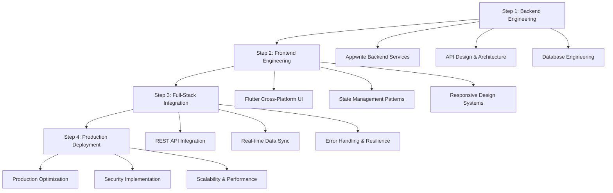

# Enterprise Full-Stack Development Learning Platform

<div align="center">


</div>

## 📋 Project Metadata

| **Attribute** | **Details** |
|---------------|-------------|
| **Author** | Mohammed Aflah |
| **Position** | Fullstack & Backend Developer, Backend Lead at Pro26 |
| **GitHub** | [@Mohd-Aflah](https://github.com/Mohd-Aflah) |
| **Organization** | Pro26 |
| **Version** | 1.0.0 |
| **License** | Pro26 & Mohd-Aflah |
| **Purpose** | Educational - Full-Stack Development Learning |
| **Architecture** | Enterprise-Grade Progressive Learning Platform |

## 🎯 Mission Statement

This **Enterprise Full-Stack Development Learning Platform** is designed to teach modern software engineering practices through a comprehensive, progressively structured curriculum. Built by industry professionals at Pro26, this platform follows **Google-scale engineering practices** and enterprise architecture patterns.

**Educational Objective**: Transform developers from beginners to production-ready full-stack engineers through hands-on, enterprise-grade project development.

## 🏗️ Enterprise Architecture Overview



## 📚 Progressive Learning Curriculum

### 🎓 **Level 1: Backend Engineering Mastery** [`01-backend-only/`](01-backend-only/)

**Engineering Focus**: Server-side architecture with enterprise-grade Appwrite integration

#### **Core Competencies**
- ✅ **Cloud Database Architecture**: Appwrite database design and optimization
- ✅ **API Engineering**: RESTful service development and documentation
- ✅ **Security Implementation**: Authentication, authorization, and data validation
- ✅ **Environment Management**: Configuration management and deployment environments
- ✅ **Testing & Quality Assurance**: Unit testing and integration testing strategies

#### **Technologies & Tools**
- **Runtime**: Node.js (Latest LTS)
- **Backend Service**: Appwrite Cloud Platform
- **Database**: Appwrite NoSQL Document Database
- **Testing**: Built-in test utilities and validation frameworks
- **DevOps**: Environment configuration and deployment automation

#### **Industry Skills Acquired**
- Backend service architecture design
- Database schema design and optimization
- API security and performance optimization
- Enterprise configuration management

---

### 🎨 **Level 2: Frontend Engineering Excellence** [`02-frontend-only/`](02-frontend-only/)

**Engineering Focus**: Cross-platform UI development with modern design systems

#### **Core Competencies**
- ✅ **Cross-Platform Development**: Flutter for Web, Mobile, and Desktop
- ✅ **Design System Implementation**: Material Design 3 enterprise patterns
- ✅ **State Management Architecture**: Reactive programming with GetX
- ✅ **Responsive Design Engineering**: Adaptive layouts for all screen sizes
- ✅ **Component Architecture**: Reusable, scalable UI component systems
- ✅ **Mock Data Integration**: Frontend development without backend dependencies

#### **Technologies & Tools**
- **Framework**: Flutter (Latest Stable)
- **Language**: Dart
- **State Management**: GetX (Enterprise-grade reactive programming)
- **Design System**: Material Design 3
- **Testing**: Widget testing and integration testing
- **Development**: Hot reload, debugging, and performance profiling

#### **Industry Skills Acquired**
- Modern frontend architecture patterns
- Component-driven development
- Performance optimization techniques
- Cross-platform deployment strategies

---

### 🔗 **Level 3: Full-Stack Integration Engineering** [`03-backend-frontend-connected/`](03-backend-frontend-connected/)

**Engineering Focus**: Enterprise-grade system integration and communication patterns

#### **Core Competencies**
- ✅ **API Integration Architecture**: HTTP client implementation and error handling
- ✅ **Real-time Data Synchronization**: Live updates and state management
- ✅ **Cross-Origin Resource Sharing**: CORS configuration for production deployment
- ✅ **Error Resilience**: Comprehensive error handling and recovery strategies
- ✅ **Performance Optimization**: Caching, lazy loading, and efficient data transfer
- ✅ **Security Integration**: Authentication flows and secure data transmission

#### **Technologies & Tools**
- **Integration Layer**: HTTP/REST API communication
- **Real-time Features**: Appwrite real-time subscriptions
- **Security**: HTTPS, authentication tokens, and secure headers
- **Monitoring**: Request/response logging and performance metrics
- **Testing**: End-to-end integration testing

#### **Industry Skills Acquired**
- Full-stack system design
- API integration best practices
- Production-ready error handling
- Performance monitoring and optimization

---

### 🚀 **Level 4: Production Engineering & Deployment** [`04-final-product/`](04-final-product/)

**Engineering Focus**: Production-ready deployment with enterprise security and scalability

#### **Core Competencies**
- ✅ **Production Architecture**: Scalable, secure, and maintainable system design
- ✅ **Security Hardening**: Enterprise-grade security implementation
- ✅ **Performance Engineering**: Optimization for high-traffic scenarios
- ✅ **Monitoring & Observability**: Production monitoring and alerting systems
- ✅ **DevOps Integration**: CI/CD pipelines and automated deployment
- ✅ **Documentation & Maintenance**: Production documentation and support procedures

#### **Technologies & Tools**
- **Production Runtime**: Optimized Node.js configuration
- **Security**: Production security headers and authentication
- **Monitoring**: Application performance monitoring (APM)
- **Deployment**: Cloud deployment strategies and containerization
- **Documentation**: Enterprise-grade API documentation and runbooks

#### **Industry Skills Acquired**
- Production system architecture
- DevOps and deployment automation
- Security and compliance implementation
- Enterprise monitoring and maintenance

---

## 🚀 Enterprise Quick Start Guide

### 🔧 **Development Environment Setup**

#### **Prerequisites** (Industry Standard)
| Tool | Version | Purpose | Installation |
|------|---------|---------|--------------|
| **Flutter SDK** | 3.24+ | Cross-platform development | [Flutter Install Guide](https://docs.flutter.dev/get-started/install) |
| **Node.js** | 18+ LTS | Backend runtime | [Node.js Downloads](https://nodejs.org/) |
| **Appwrite Account** | Cloud/Self-hosted | Backend services | [Appwrite Cloud](https://cloud.appwrite.io) |
| **VS Code** | Latest | Development IDE | [VS Code Download](https://code.visualstudio.com/) |
| **Git** | Latest | Version control | [Git Downloads](https://git-scm.com/) |

#### **Required VS Code Extensions**
```bash
# Install essential extensions
code --install-extension Dart-Code.flutter
code --install-extension Dart-Code.dart-code
code --install-extension ms-vscode.vscode-json
code --install-extension bradlc.vscode-tailwindcss
```

### 📋 **Learning Path Execution**

#### **🎯 Level 1: Backend Engineering**
```bash
# Navigate to backend engineering module
cd 01-backend-only/backend

# Install dependencies
npm install

# Configure Appwrite environment
cp .env.example .env
# Edit .env with your Appwrite credentials

# Validate setup
npm run setup    # Test Appwrite connectivity
npm run test     # Execute development tests
npm run dev      # Start development server
```

#### **🎨 Level 2: Frontend Engineering**
```bash
# Navigate to frontend engineering module
cd 02-frontend-only/frontend

# Install Flutter dependencies
flutter pub get

# Validate Flutter installation
flutter doctor

# Launch development environment
flutter run -d chrome    # Web development
flutter run -d windows   # Desktop development (Windows)
flutter run              # Mobile development (with emulator)
```

#### **🔗 Level 3: Full-Stack Integration**
```bash
# Terminal Session 1: Backend Services
cd 03-backend-frontend-connected/backend
npm install && npm start

# Terminal Session 2: Frontend Application
cd 03-backend-frontend-connected/frontend
flutter pub get && flutter run -d chrome
```

#### **🚀 Level 4: Production Deployment**
```bash
# Navigate to production environment
cd 04-final-product

# Configure production environment
cp backend/.env.example backend/.env.production
# Configure production Appwrite credentials

# Build and deploy
npm run production    # Backend production server
flutter build web    # Frontend production build
```

### 🏗️ **Enterprise Technology Stack**

#### **Backend Architecture** (Google-scale practices)
```yaml
Runtime Environment:
  - Node.js 18+ LTS (Production stability)
  - Appwrite Cloud Platform (Enterprise BaaS)
  
Database Layer:
  - Appwrite NoSQL Document Database
  - Real-time synchronization
  - Automatic scaling and backup
  
API Layer:
  - RESTful API design
  - JWT authentication
  - Rate limiting and security headers
  
Development Tools:
  - Environment-based configuration
  - Automated testing utilities
  - Performance monitoring
```

#### **Frontend Architecture** (Modern enterprise patterns)
```yaml
Framework:
  - Flutter 3.24+ (Cross-platform stability)
  - Dart (Type-safe, performant language)
  
Architecture Patterns:
  - GetX (Reactive state management)
  - Material Design 3 (Google's design system)
  - Component-driven development
  
Performance:
  - Hot reload development
  - Tree shaking optimization
  - Lazy loading and caching
  
Testing:
  - Widget testing
  - Integration testing
  - Performance profiling
```

#### **DevOps & Infrastructure** (Industry standards)
```yaml
Development:
  - Git version control
  - Environment configuration
  - Automated testing pipelines
  
Production:
  - Containerization support
  - Cloud deployment ready
  - Monitoring and logging
  - Security hardening
  
Scalability:
  - Horizontal scaling support
  - Load balancing ready
  - CDN integration
  - Performance optimization
```

---

## 📊 **Enterprise Learning Outcomes**

### **� Skill Certification Matrix**

| **Competency Area** | **Level 1** | **Level 2** | **Level 3** | **Level 4** |
|---------------------|-------------|-------------|-------------|-------------|
| **Backend Development** | ✅ API Design | ✅ Service Architecture | ✅ System Integration | ✅ Production Ops |
| **Frontend Development** | ⚪ Basic UI | ✅ Component Systems | ✅ State Management | ✅ Performance Opt |
| **Database Engineering** | ✅ CRUD Operations | ✅ Schema Design | ✅ Real-time Sync | ✅ Optimization |
| **DevOps & Deployment** | ⚪ Local Setup | ⚪ Development | ✅ Integration | ✅ Production |
| **Security Implementation** | ✅ Authentication | ✅ Authorization | ✅ Secure Transport | ✅ Enterprise Security |
| **Performance Engineering** | ⚪ Basic | ✅ Frontend Opt | ✅ Full-stack Opt | ✅ Production Scale |

**Legend**: ✅ Core Focus | ⚪ Introduction Level

### **🎯 Career Readiness Assessment**

Upon completion of this learning platform, developers will have acquired:

- **✅ Production-Ready Full-Stack Skills**: Industry-standard development practices
- **✅ Enterprise Architecture Understanding**: Scalable system design patterns  
- **✅ Modern Technology Proficiency**: Flutter, Node.js, Appwrite, and cloud services
- **✅ DevOps Integration Knowledge**: CI/CD, deployment, and monitoring
- **✅ Security Implementation Skills**: Authentication, authorization, and data protection
- **✅ Performance Optimization Expertise**: Frontend and backend optimization techniques

---

#### 🎯 I want to learn Frontend Development (Mock Data)
```bash
cd 02-frontend-only/frontend
flutter pub get
flutter run -d chrome  # Runs with mock data, no backend needed
```

#### 🎯 I want to learn Full-Stack Integration
```bash
# Terminal 1: Start Appwrite backend
cd 03-backend-frontend-connected/backend
npm install && npm start

# Terminal 2: Start Flutter frontend
cd 03-backend-frontend-connected/frontend
flutter pub get && flutter run -d chrome
```

#### 🎯 I want to deploy to Production
```bash
cd 04-final-product
# Configure production environment
# Follow production deployment guide
npm run production
```

## 🛠️ Technology Stack

### Backend (Pure Appwrite)
- **Node.js**: JavaScript runtime for Appwrite SDK
- **Appwrite SDK**: Complete backend services (Database, Auth, Storage)
- **HTTP Module**: Minimal Node.js server for API endpoints
- **Environment Variables**: Secure configuration management
- **No Express.js**: Pure Appwrite implementation, no unnecessary middleware

## 📄 **Enterprise Licensing & Legal**

### **📋 License Information**
```
Copyright (c) 2025 Pro26 & Mohammed Aflah (Mohd-Aflah)

Educational License - Study Purpose Only

Permission is hereby granted, free of charge, to any person obtaining a copy
of this educational software and associated documentation files (the "Learning Platform"),
to study, learn, and practice software development skills for educational purposes only.

EDUCATIONAL USE ONLY:
- ✅ Personal learning and skill development
- ✅ Academic research and study
- ✅ Portfolio development for career advancement
- ✅ Contributing to open-source learning initiatives

COMMERCIAL USE RESTRICTIONS:
- ❌ Commercial deployment without explicit permission
- ❌ Redistribution for commercial purposes
- ❌ Modification for commercial products

For commercial use inquiries, contact: Pro26 or Mohammed Aflah
```

### **🏢 About Pro26**
**Pro26** is a technology consulting and development organization specializing in enterprise-grade software solutions. This learning platform represents our commitment to knowledge sharing and developer community growth.

### **👨‍💻 About the Author**
**Mohammed Aflah** - Fullstack & Backend Developer, Backend Lead at Pro26
- **GitHub**: [@Mohd-Aflah](https://github.com/Mohd-Aflah)
- **Specialization**: Enterprise backend architecture, full-stack development
- **Experience**: Leading backend teams and implementing scalable solutions

---

## 🚀 **Get Started Today**

Ready to begin your enterprise full-stack development journey? Choose your starting point:

<div align="center">

[](./01-backend-only/)
[](./02-frontend-only/)
[](./03-backend-frontend-connected/)
[](./04-final-product/)

---

**⭐ Star this repository if you find it helpful for your learning journey!**

**🤝 Contribute to the learning community - Pull requests welcome!**

**📧 Questions? Open an issue or contact the maintainers.**

</div>

---

<div align="center">

**Built with ❤️ by Mohammed Aflah & Pro26 Team**

*Empowering the next generation of full-stack developers*


</div>

### Frontend Skills
- ✅ Build responsive mobile and web applications
- ✅ Implement modern UI/UX patterns
- ✅ Manage complex application state
- ✅ Handle forms and user input
- ✅ Deploy applications to multiple platforms

### Full-Stack Skills
- ✅ Design end-to-end application architecture
- ✅ Integrate frontend and backend systems
- ✅ Handle real-time data synchronization
- ✅ Implement security best practices
- ✅ Deploy and maintain production systems

## 🔧 Project Features

### Intern Management System
This project implements a complete intern management system with:

- **👥 Intern Management**: CRUD operations for intern records
- **📊 Dashboard**: Statistics and overview screens
- **📋 Task Management**: Assign and track intern tasks
- **🔍 Search & Filter**: Advanced filtering capabilities
- **📱 Responsive Design**: Works on mobile, tablet, and desktop
- **🔄 Real-time Updates**: Live data synchronization
- **🎨 Modern UI**: Material Design 3 implementation

## 📈 Difficulty Progression

```
Beginner    Intermediate    Advanced    Expert
    │            │             │          │
    ▼            ▼             ▼          ▼
Step 1 ──────> Step 2 ────> Step 3 ──> Step 4
Backend      Frontend     Connected   Production
  Only         Only      Full-Stack   Deployment
```

### Estimated Time Investment
- **Step 1**: 2-3 days (Backend fundamentals)
- **Step 2**: 3-4 days (Frontend development)
- **Step 3**: 2-3 days (Integration)
- **Step 4**: 1-2 days (Deployment)

**Total**: ~8-12 days for complete mastery

## 🎓 Recommended Learning Order

### For Complete Beginners
1. **Start with Step 1** (Backend Only) - Understand server-side concepts
2. **Move to Step 2** (Frontend Only) - Learn UI development
3. **Progress to Step 3** (Connected) - Understand full-stack integration
4. **Finish with Step 4** (Production) - Learn deployment

### For Frontend Developers
1. **Start with Step 2** (Frontend Only) - Familiar territory
2. **Move to Step 1** (Backend Only) - Learn server-side
3. **Progress to Step 3** (Connected) - Integrate knowledge
4. **Finish with Step 4** (Production) - Deploy your skills

### For Backend Developers
1. **Start with Step 1** (Backend Only) - Familiar territory
2. **Move to Step 2** (Frontend Only) - Learn UI development
3. **Progress to Step 3** (Connected) - Apply both skills
4. **Finish with Step 4** (Production) - Complete the picture

## 🔗 Additional Resources

### Documentation
- [Flutter Documentation](https://docs.flutter.dev/)
- [Node.js Documentation](https://nodejs.org/docs/)
- [Appwrite Documentation](https://appwrite.io/docs)
- [Material Design 3](https://m3.material.io/)

### Tools
- [VS Code](https://code.visualstudio.com/) - Recommended editor
- [Flutter DevTools](https://docs.flutter.dev/development/tools/devtools/overview)
- [Postman](https://www.postman.com/) - API testing
- [Git](https://git-scm.com/) - Version control

### Community
- [Flutter Community](https://flutter.dev/community)
- [Node.js Community](https://nodejs.org/en/get-involved/)
- [Stack Overflow](https://stackoverflow.com/)
- [GitHub Discussions](https://github.com/features/discussions)

## 🆘 Getting Help

### Common Issues
Each step folder contains comprehensive troubleshooting guides for common development issues.

### Professional Support
- **GitHub Issues**: Report bugs and request features at [Mohd-Aflah](https://github.com/Mohd-Aflah)
- **Documentation**: Enterprise-grade guides in each folder
- **Pro26 Community**: Connect with professional developers

### Prerequisites Check
Before starting, verify your development environment:
```bash
# Check Flutter installation
flutter doctor

# Check Node.js installation
node --version
npm --version

# Check Git installation
git --version
```

---

## 📄 License & Credits

**Created by**: Mohammed Aflah  
**Position**: Fullstack & Backend Developer, Backend Lead at Pro26  
**GitHub**: [Mohd-Aflah](https://github.com/Mohd-Aflah)  

**License**: This project is licensed under Pro26 & Mohd-Aflah  
**Copyright**: © 2025 Pro26 & Mohammed Aflah (Mohd-Aflah)  

### Professional Expertise
- ✅ **Backend Development**: Node.js, Python, Java, API Design
- ✅ **Frontend Development**: Flutter, React, Vue.js, Mobile Development  
- ✅ **Database Design**: SQL, NoSQL, Appwrite, Firebase, MongoDB
- ✅ **DevOps & Deployment**: Docker, CI/CD, Cloud Platforms
- ✅ **Architecture**: Microservices, Clean Architecture, Design Patterns

### About Pro26
Pro26 is a leading technology company specializing in innovative software solutions and professional development training.

---

## 🎉 Ready to Start Your Journey?

Choose your starting point based on your experience level and learning goals. Each step builds upon the previous one, following industry best practices from a Backend Lead's perspective.

**Start building enterprise-grade applications today!** 🚀

*Crafted with expertise by Mohammed Aflah - Backend Lead at Pro26*

*This learning path is designed to take you from beginner to production-ready full-stack developer in a structured, hands-on way.*
